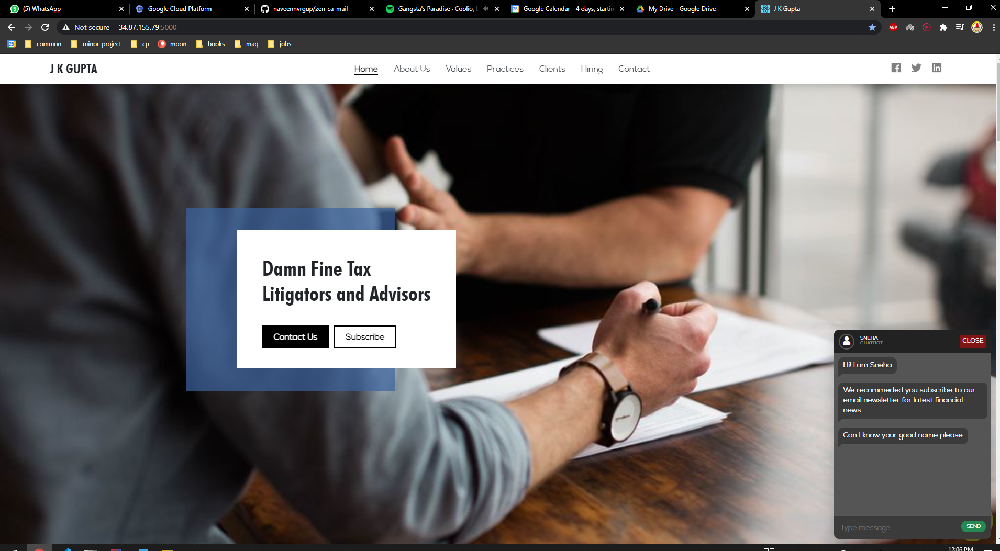
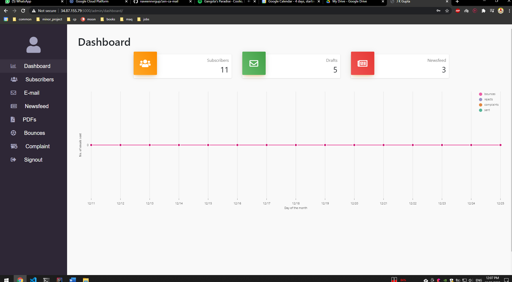
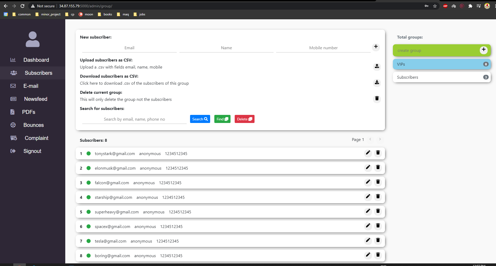
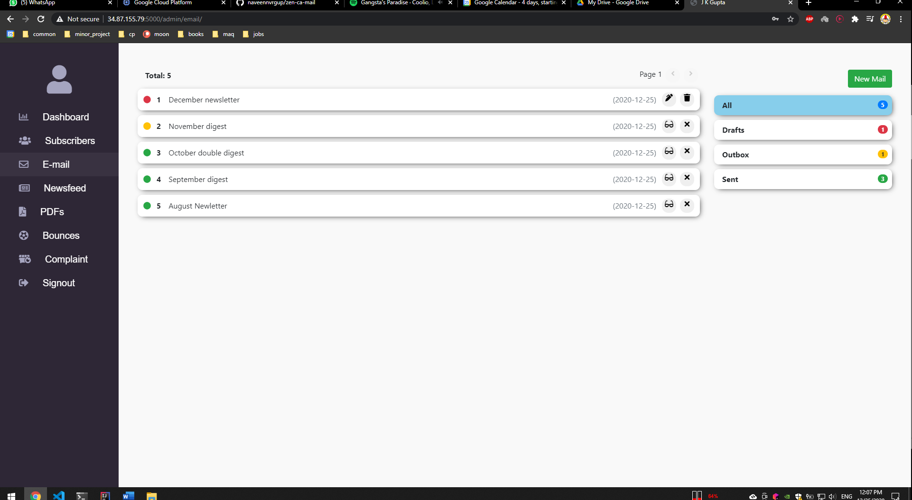

# Zen Portfolio Site & Dashbaord

This website is a combination of custom porfolio site and admin site for freelance client (since decomissioned after two years of use in production). 

### Demo:

- Hosted at  [http://34.87.142.140:5000/](http://34.87.142.140:5000/)
- Admin site at [http://34.87.142.140:5000/admin](http://34.87.142.140:5000/admin)
    * **username:** admin (😜)
    * **password:** admin (😉)
- Email sending wont work as I dont pay for AWS SES anymore 😅
- While uploading files will work you can't view them as static storage is not paid for 💸

### Admin site features:
1. Dashboard page - showcases overall stats 
1. contacts page - can manage subscribers, create groups etc.,
1. drafts page - create, send and manage emails
1. complaints and bounces management

### Techstack:
- Django with DRF on the backend 
- React with bootstrap4 on the frontend
- Token authentication used
- Web servcies used are primarily AWS
    * AWS SES
    * AWS EC2
    * AWS Route53
    * Godaddy DNS

### Screenshots:

